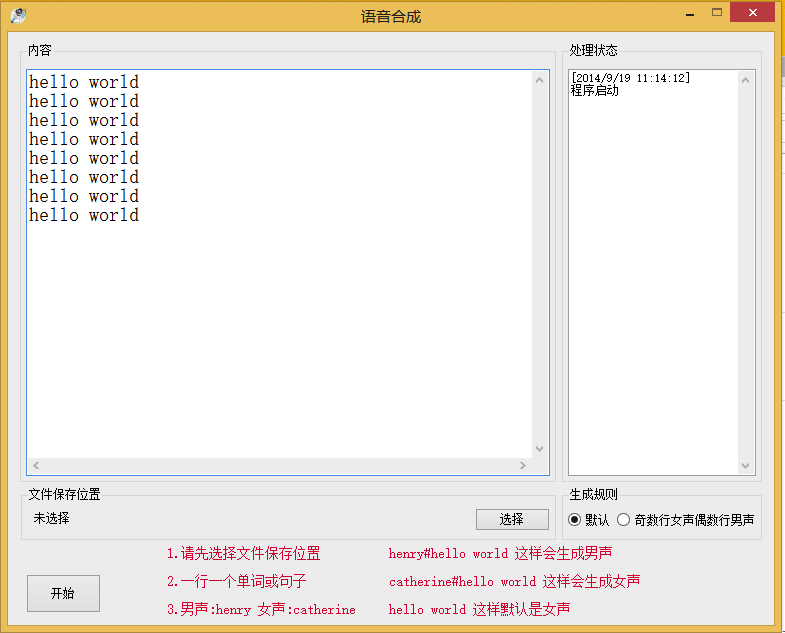

iflytek-csharp-demo
===================

科大讯飞c#Demo

论坛里有个c#的demo 

[http://club.voicecloud.cn/forum.php?mod=viewthread&tid=436&fromuid=20599](http://club.voicecloud.cn/forum.php?mod=viewthread&tid=436&fromuid=20599)

不过作者好久没更新了，用的还是老的sdk，现在新的sdk版本有些函数有些改动，而且以前的需要的.net环境是4.0 

现在我进行了修改，修复了一些获取音频问题 ，兼容低版本环境.net2.0也可以使用了，供大家参考